<div align="center">

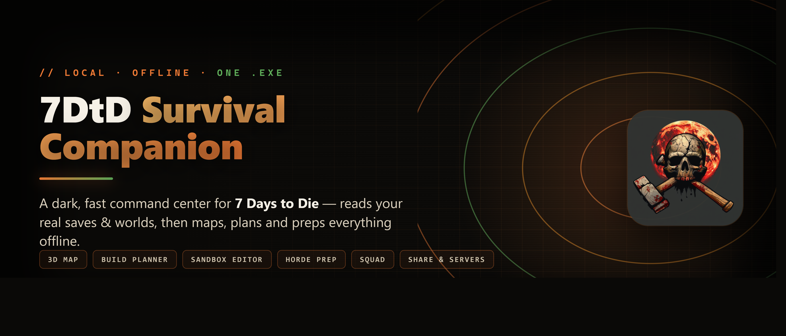

<br><br>

[](https://github.com/Lampe332/7dtd-survival-companion/releases/latest)
[](https://github.com/Lampe332/7dtd-survival-companion/releases)


</div>

---

## What it is

One self-contained Windows `.exe`. Double-click it and a dark, fast control panel opens in your browser — it scans your **real** _7 Days to Die_ saves and generated worlds and turns them into a full operational toolkit: a 3D map of your world, a gate-correct build planner, a sandbox-settings editor that writes back to your game, horde-night prep, a squad board, and more.

No installer. No account. No cloud. No telemetry. Everything it reads and writes stays on your machine.

<div align="center">

### ⬇️ [**Download the latest `.exe`**](https://github.com/Lampe332/7dtd-survival-companion/releases/latest) &nbsp;·&nbsp; run it &nbsp;·&nbsp; press **Scan**

</div>

---

## 🎬 See it in action

<div align="center">

[](https://github.com/Lampe332/7dtd-survival-companion/releases/download/v1.38.0/demo.mp4)

<sub>A guided tour through the tabs &nbsp;·&nbsp; <b><a href="https://github.com/Lampe332/7dtd-survival-companion/releases/download/v1.38.0/demo.mp4">▶ watch the full video (MP4)</a></b></sub>

</div>

---

## The tabs

| Tab | What it does |
|---|---|
| 🌍 **World** | Sandbox-settings editor with byte-exact write-back + backups · one-click difficulty presets |
| 🗺️ **3D Map** | WebGL map of your world — POI search, fly-cam, fullscreen, biome overlay, base finder |
| 🧭 **Dashboard** | Day, Blood Moon countdown, Game Stage, build & loot readiness — live from your save |
| 🔨 **Build** | 19 gate-correct perk routes · one skill point per step · imports your real progression |
| 📊 **Perks** | All 57 perks with a per-rank effect breakdown |
| 🩸 **Horde** | Special-enemy threat sheet + counters + a loadout that follows your build |
| 👥 **Squad** | 8-player role coverage, Blood Moon battle plan, ammo matrix, PvP playbook |
| 📦 **Loot** | Loot-stage → gear-tier calculator |
| 📕 **Magazines** | 23 crafting magazines · quality ladder · "what to read next" tracker |
| 📚 **Wiki** | Live search of the 7DtD Fandom wiki, in-app (works offline from cache) |
| 📖 **Reference** | Quick cards: biomes, attributes, buffs, trader, gamestage |

Plus a top bar with **⌕ Global Search (Ctrl+K)**, **🔔 Blood-Moon alerts**, and **◉ LIVE auto-refresh** that follows the game as you play.

---

## Features

### 🗺️ Your actual world, in 3D
Terrain, roads, water and 2 000+ POIs decoded straight from your save files. Fly the camera, search any building by its in-game or brand name, toggle fullscreen, and click a POI for its tier, zombie count and quests. A **biome overlay** and a **base-location finder** score the map and fly you to the best spots.

<details><summary>📷 Screenshot — 3D world map</summary><br>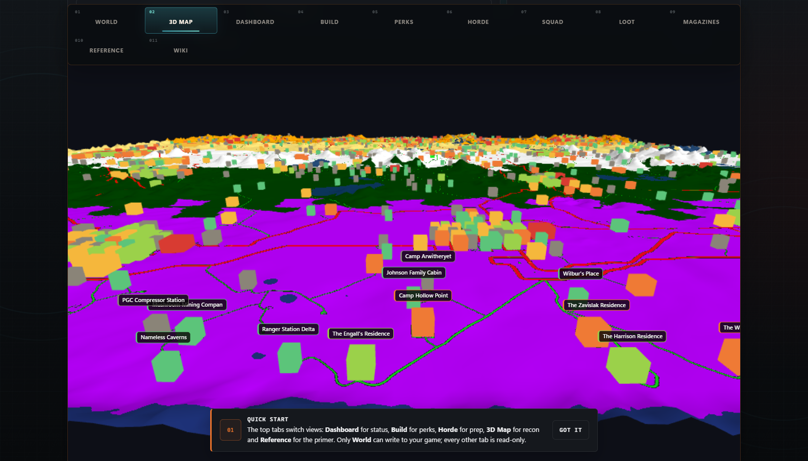</details>

### 🌍 A settings editor that writes back
Edit `gameOptions.sdf` directly — all **150** sandbox options, using the game's real value lists, each with a plain-English explanation. Every save makes a **timestamped backup** with one-click restore. **Ten one-click difficulty presets** (Baby → Nightmare → Insane+, plus Builder, Looter, Marathon, Glass Cannon, Permadeath) set a whole profile at once.

<details><summary>📷 Screenshot — World settings editor</summary><br>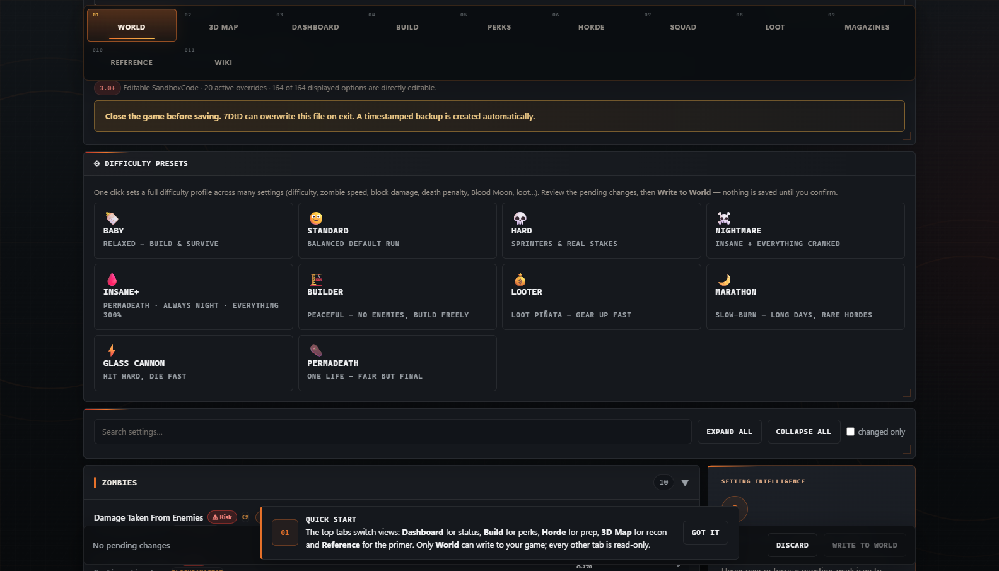</details>

### 🔨 Build planner — 19 gate-correct routes
A guided, phase-by-phase plan that imports your real `.ttp` progression. **Every step is one skill point** — each perk rank and attribute level with its real per-level effect. Pick any of the 57 perks and it slots into the route at the phase its gate unlocks, prerequisites auto-inserted. Each route shows a win-condition rationale, a skill-point budget, and exports to Markdown.

<details><summary>📷 Screenshot — Build planner</summary><br>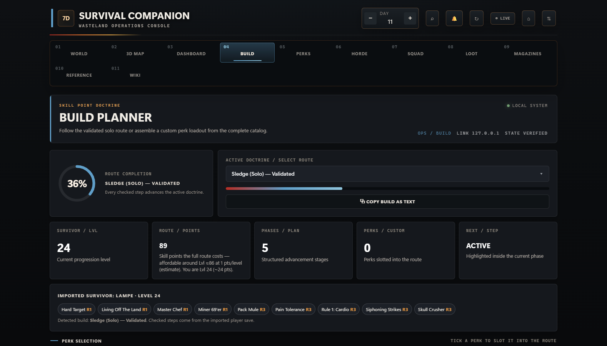</details>

### 🩸 Horde night, handled
A readiness checklist, a real special-enemy threat sheet with counters (Demolisher chest charge, Cop suicide-explosion, Wight, Screamer heat…), the Blood Moon sequence, and a **combat loadout that follows your active build**.

<details><summary>📷 Screenshot — Horde command</summary><br>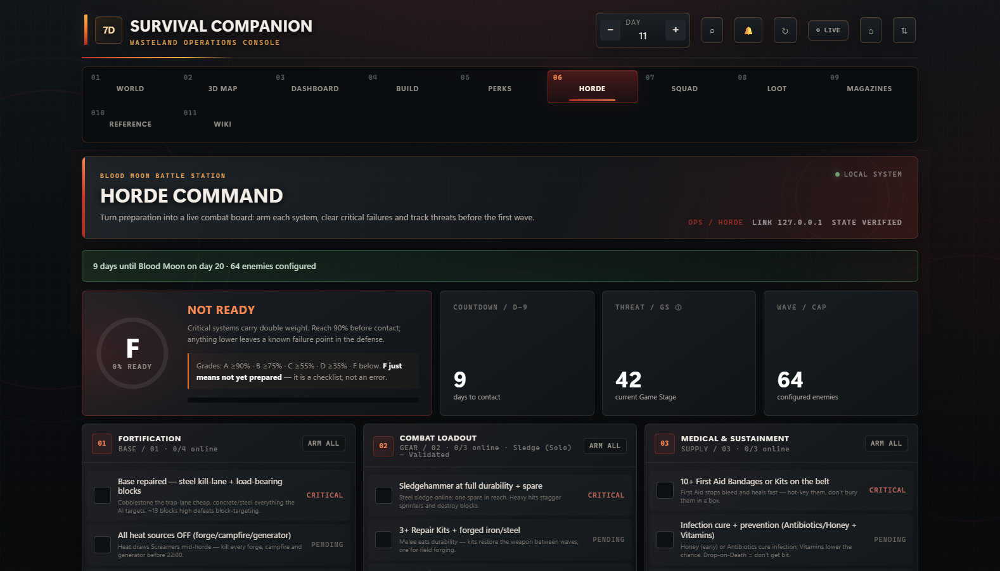</details>

### 👥 Squad board — for co-op & 8-player servers
Assign up to eight teammates a build and see **role-coverage gaps** at a glance (Anchor / Ranged / Flanker / Support) with **one-click fill**, the real party Game Stage, a **Blood Moon battle plan** (who holds the funnel, who snipes Demolishers, who repairs), an **ammo & supply matrix**, and a PvP counter playbook.

<details><summary>📷 Screenshot — Squad board</summary><br>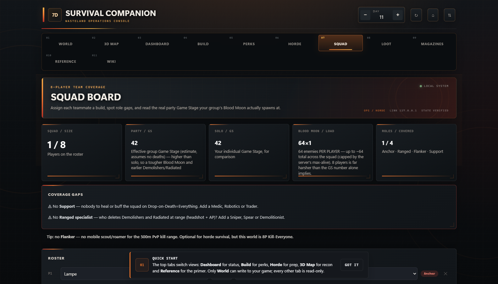</details>

### 📕 Magazines — what to read next
All 23 crafting magazines with a readable **quality ladder** (Q1–Q6) and a **Closest Unlocks** tracker that tells you exactly which magazine to read next, plus 19 perk-book series.

<details><summary>📷 Screenshot — Magazine archive</summary><br>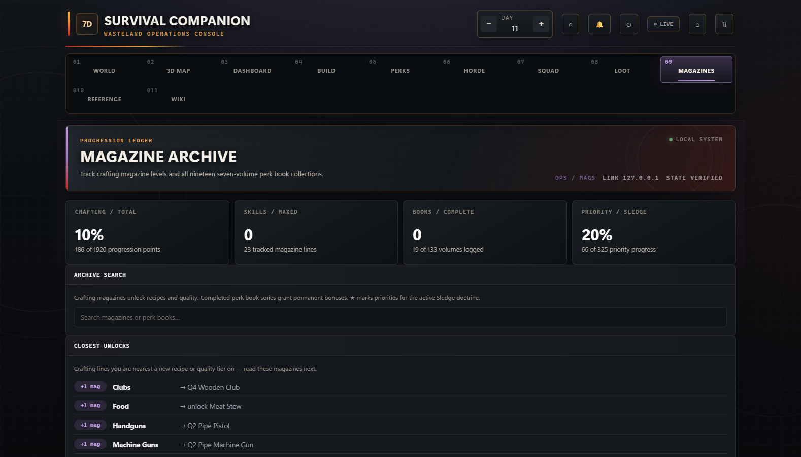</details>

<details>
<summary><b>More tabs</b> — Dashboard · Perks · Loot · Wiki · Reference</summary>

<br>

**🧭 Dashboard** — days to the next Blood Moon, Game Stage, build progress, loot stage and a readiness grade, live from the save.
<br>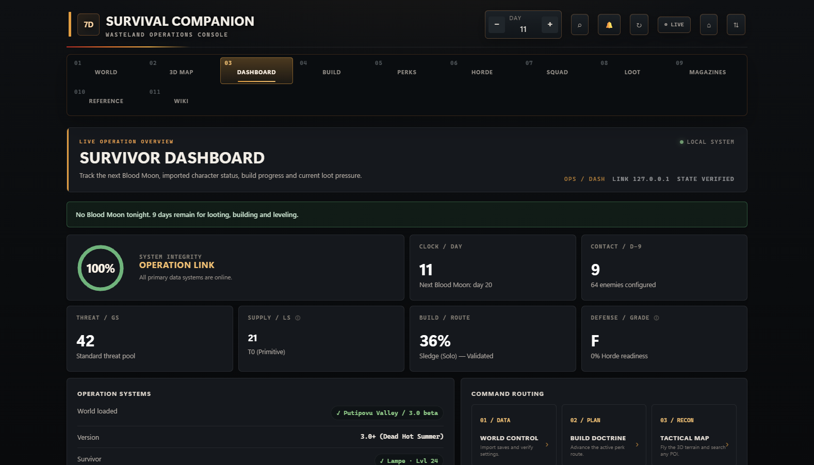

**📊 Perks** — every perk with an expandable breakdown of all five ranks.
<br>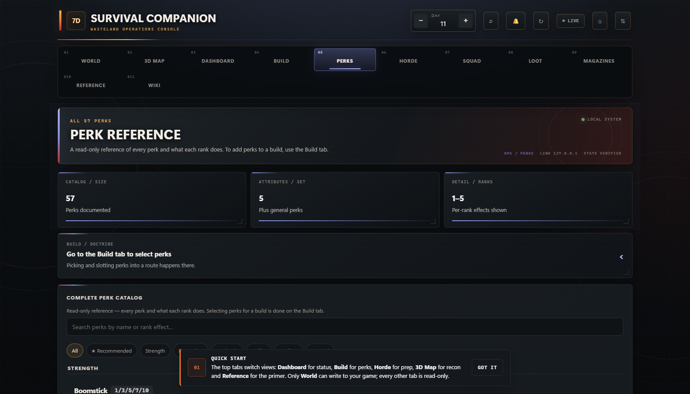

**📦 Loot** — loot-stage → gear-tier calculator with the real thresholds.
<br>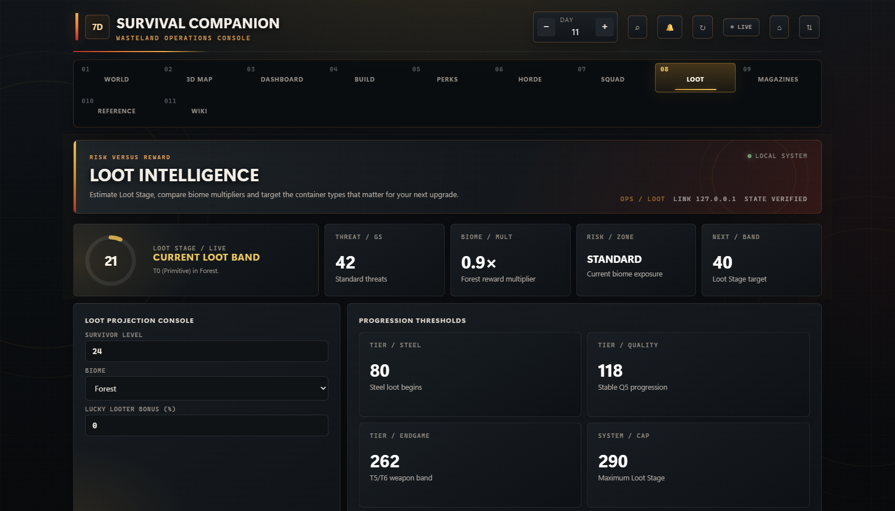

**📚 Wiki** — live Fandom search in-app, cached for offline use.
<br>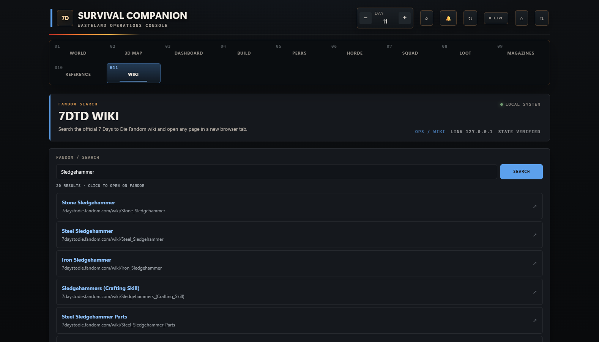

**📖 Reference** — quick cards for biomes, attributes, buffs, the trader and gamestage thresholds, with a beginner primer.
<br>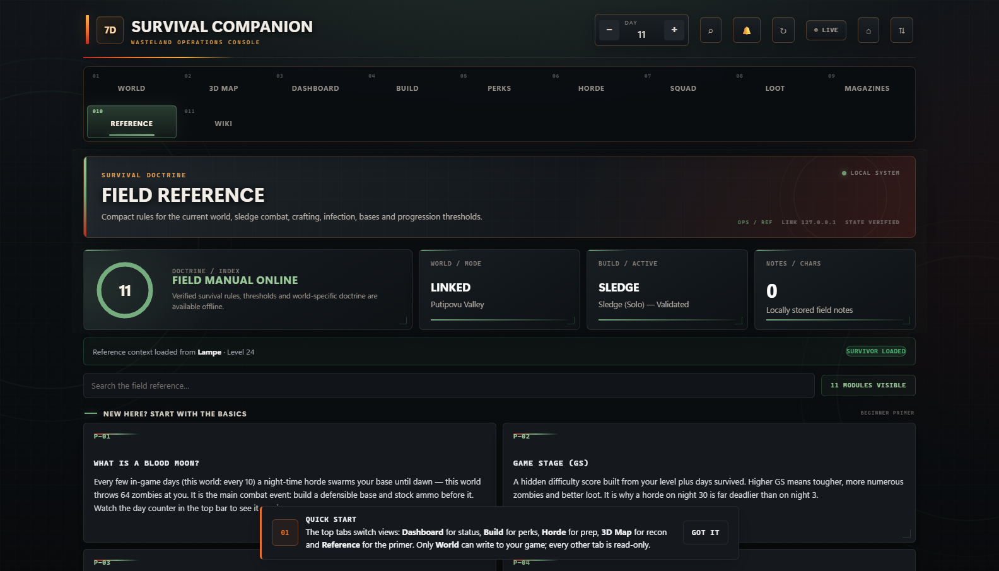

</details>

### ⚡ Always on hand

- **⌕ Global Search (Ctrl+K)** — jump straight to any perk, build, magazine, POI or setting.
- **◉ LIVE mode** — re-reads your save every ~10 s, so the day, level, magazines and Blood Moon countdown follow the game while you play.
- **🔔 Blood-Moon alerts** — an optional desktop notification the day before a horde night.
- **📡 Offline wiki cache** — wiki searches are cached, so they keep working with no connection.

---

## 🛰️ Playing on a server? Sharing with friends?

The app normally reads your **local** game folder — but it can also read from elsewhere, and let you hand your whole map to a friend.

- **Custom / network folder** — point it at any path or UNC share that holds your `Saves` + `GeneratedWorlds`.
- **Dedicated server (SFTP / FTP)** — enter host, user and the remote folder; it pulls just what it needs and reads your world live while you play on the server.
- **Share your world** — hosting a world your friend doesn't have? Export a small `.7dtdworld.json` and they get your **full 3D map** (terrain, POIs, settings) without your save files. Loads read-only.

Credentials stay in memory for the session — never written to disk. The local server stays locked to your machine; sharing is a file you send, not an open port.

<details><summary>📷 Screenshot — data source & sharing panel</summary><br>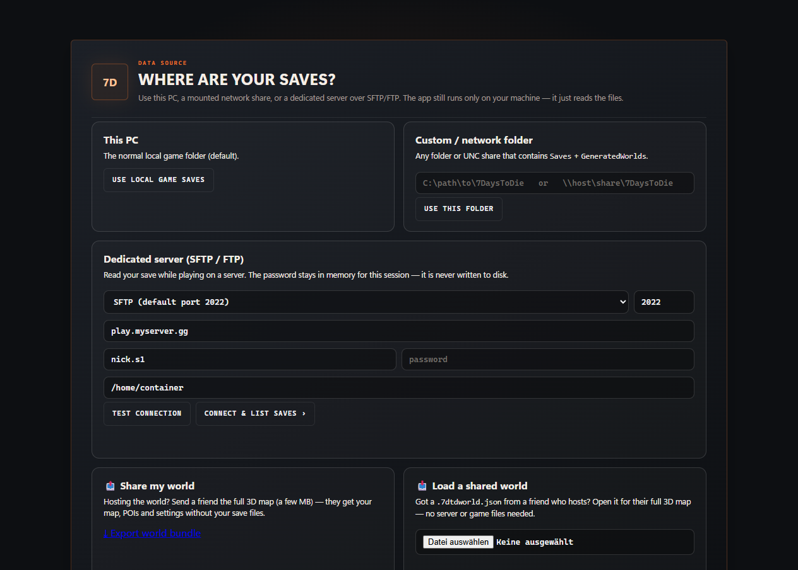</details>

---

## Download & run

1. Download **`7DtD Companion.exe`** from the **[latest release](https://github.com/Lampe332/7dtd-survival-companion/releases/latest)**.
2. Double-click it — it opens in your default browser. No install, no dependencies, one self-contained file.
3. Press **Scan**, pick your world, pick your survivor — done.

> Windows may flag a freshly downloaded, unsigned `.exe`. If SmartScreen appears, choose **More info → Run anyway**. The full source is in this repo — build it yourself if you prefer (below).

## How it works & privacy

The app reads, it doesn't phone home:

- **Saves** — `…/7DaysToDie/Saves/<world>/<save>/` → settings (`gameOptions.sdf`), players and progression (`.ttp`).
- **Worlds** — `…/7DaysToDie/GeneratedWorlds/<world>/` → terrain, biomes, water and POIs for the 3D map.
- **Game install** *(optional)* → prefab tiers and POI thumbnails.

The **only** thing it ever writes is the world settings you change yourself in the World tab — and only after a timestamped backup you can restore in one click. 100% local: no account, no analytics, no background services. The only network call is the in-app wiki search you trigger yourself. Close the tab and it's gone.

## Build from source

```bash
cargo build --release
# output: target/release/seven-dtd-companion.exe
```

The frontend (`7DtD_Skill_Tracker.html`) and reference data (`src/refdata.json`) are baked into the binary with `include_str!`, so the resulting `.exe` is fully self-contained.

## Tech

| | |
|---|---|
| **Backend** | Rust + [`tiny_http`](https://crates.io/crates/tiny_http) — file scanning, binary `.sdf` / `.ttp` parsing, settings write-back, map decoding, SFTP/FTP ([`russh`](https://crates.io/crates/russh) · [`suppaftp`](https://crates.io/crates/suppaftp)) |
| **Frontend** | Vanilla JS, single file, hand-rolled WebGL for the 3D map — no framework, no build step |
| **Platform** | Windows · **UI language:** English |

## License

MIT — see [LICENSE](LICENSE). Not affiliated with The Fun Pimps. _7 Days to Die_ is a trademark of its respective owners.
